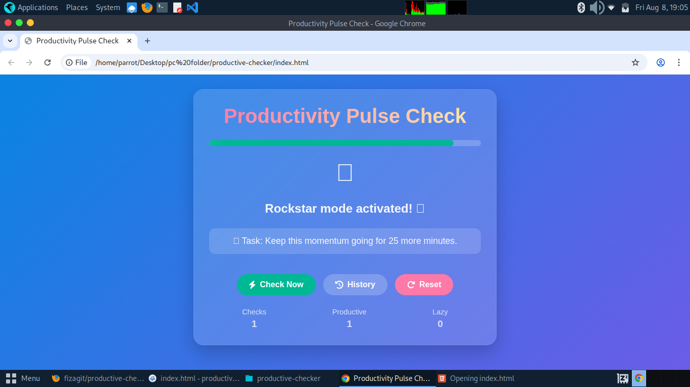
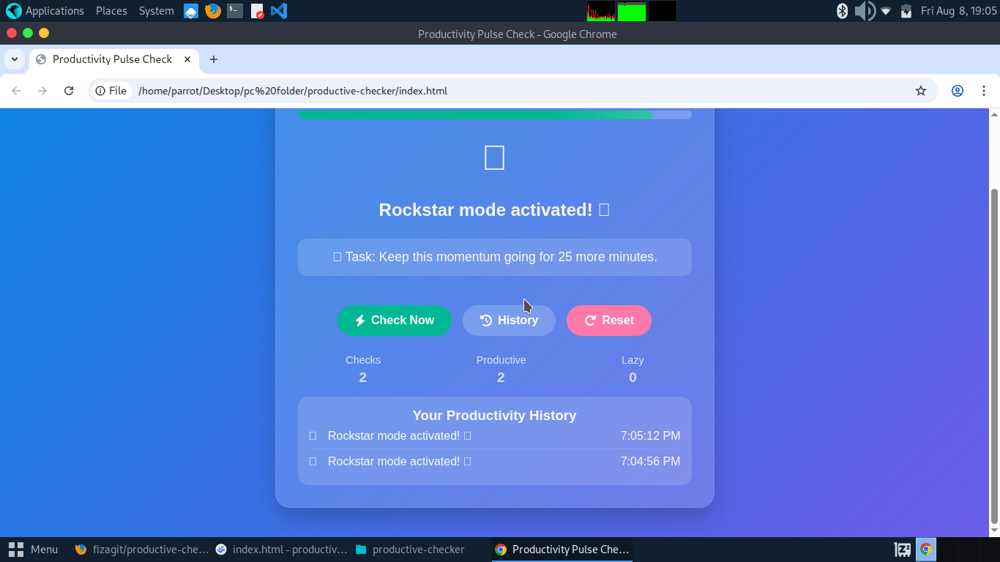

# Am I Being Productive? 💭

# Productivity Pulse Checker ⚡

A lighthearted, interactive website that answers the age-old question: *"Am I being productive?"* with a twist.  
Every click gives you a random, witty, or motivational response… and maybe a little push to get back to work.  

## ✨ Features
- 🎯 Multiple response categories — Motivational, Sarcastic, Neutral, and Silly.
- 🎨 Colorful, gradient-based design with smooth animations.

## 🚀 How to Use
1. Open the HTML file in your browser.
2. Click **"Check Again"** whenever you need a dose of honesty (or sarcasm).
3. Repeat until you feel like doing actual work… or not. 😏

## 🚀 Live Demo !!
[Try it here!](https://fizagit.github.io/productive-checker/)

## 📸 Preview

## 💡 Why I Made This
Sometimes we need a reminder or a laugh when procrastination creeps in right?This project is my fun take on productivity check-ins, and a tiny escape from the “serious” side of coding.

## 🛠️ Tech Used
- HTML
- CSS
- JavaScript
